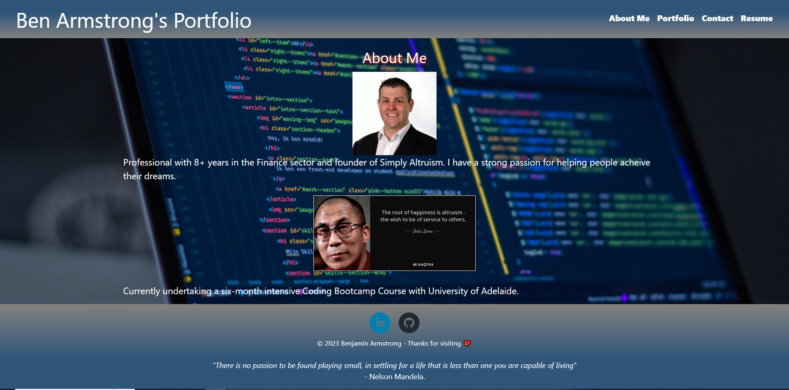
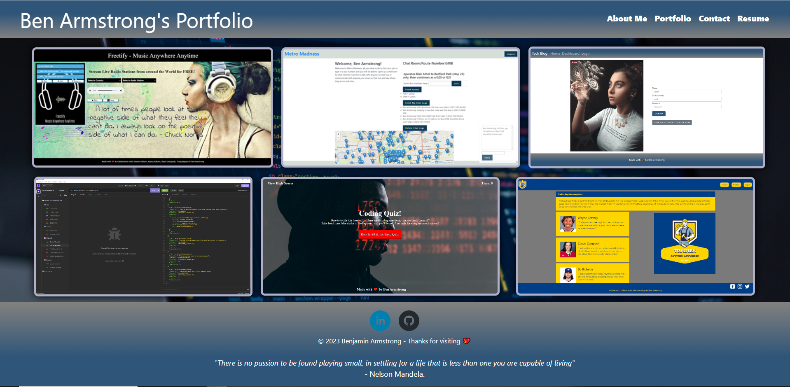
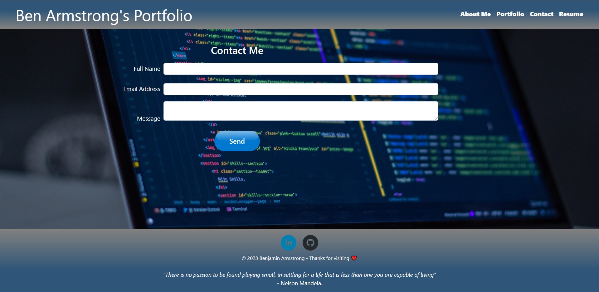
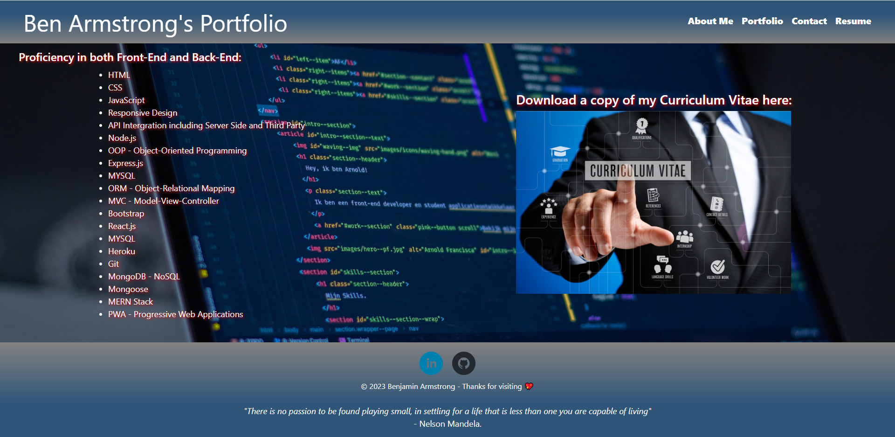

# Ben-Armstrong-React-Portfolio
20 React: React Portfolio
## Our Task this Week

Our task this week was to build a portfolio using our new React skills. With the view it will help set us apart from other developers whose portfolios don’t use the latest technologies. We were to deploy this application to GitHub Pages. 

## User Story

```md
AS AN employer looking for candidates with experience building single-page applications
I WANT to view a potential employee's deployed React portfolio of work samples
SO THAT I can assess whether they're a good candidate for an open position
```

## Acceptance Criteria

```md
GIVEN a single-page application portfolio for a web developer
WHEN I load the portfolio
THEN I am presented with a page containing a header, a section for content, and a footer
WHEN I view the header
THEN I am presented with the developer's name and navigation with titles corresponding to different sections of the portfolio
WHEN I view the navigation titles
THEN I am presented with the titles About Me, Portfolio, Contact, and Resume, and the title corresponding to the current section is highlighted
WHEN I click on a navigation title
THEN I am presented with the corresponding section below the navigation without the page reloading and that title is highlighted
WHEN I load the portfolio the first time
THEN the About Me title and section are selected by default
WHEN I am presented with the About Me section
THEN I see a recent photo or avatar of the developer and a short bio about them
WHEN I am presented with the Portfolio section
THEN I see titled images of six of the developer’s applications with links to both the deployed applications and the corresponding GitHub repositories
WHEN I am presented with the Contact section
THEN I see a contact form with fields for a name, an email address, and a message
WHEN I move my cursor out of one of the form fields without entering text
THEN I receive a notification that this field is required
WHEN I enter text into the email address field
THEN I receive a notification if I have entered an invalid email address
WHEN I am presented with the Resume section
THEN I see a link to a downloadable resume and a list of the developer’s proficiencies
WHEN I view the footer
THEN I am presented with text or icon links to the developer’s GitHub and LinkedIn profiles, and their profile on a third platform (Stack Overflow, Twitter)
```
## Grading Requirements
* Satisfies all of the preceding acceptance criteria plus the following:
    * Application must use React to render content.
    * Application has a single `Header` component that appears on multiple pages, with a `Navigation` component within it that’s used to conditionally render About Me, Portfolio, Contact, and Resume sections.
    * Application has a single `Project` component that’s used multiple times in the Portfolio section.
    * Application has a single `Footer` component that appears on multiple pages.
    * Application must be deployed to GitHub Pages.
* Application deployed at live URL.
* Application loads with no errors.
* Application GitHub URL submitted.
* GitHub repository contains application code.
* User experience is intuitive and easy to navigate.
* User interface style is clean and polished.
* Application uses a color scheme other than the default Bootstrap color palette.
* Repository has a unique name.
* Repository follows best practices for file structure and naming conventions.
* Repository follows best practices for class/id naming conventions, indentation, quality comments, etc.
* Repository contains multiple descriptive commit messages.
* Repository contains high-quality README file with description, screenshot, and link to deployed application.

## Table of Content
* [Credits](#credits)
* [What-I-Learned](#what-i-learned)
* [Deployment](#deployment)
* [Installation](#installation)
* [Usage](#usage)
* [Made-With](#made-with)
* [License](#license)

# Credits
* Ben Armstrong https://github.com/BenArmstrong81 <br>

*With special thanks to The University of Adelaide Full Stack Web Development Class.*

# What-I-Learned
Building on the two thirds of the course and extending on from the last couple weeks using Node.js we learnt how to incororate React.js, and how to make a more responsive application. The modules in class included but not limited to; Event handling, forms, hooks, fetching data, render elements and styling.

# Deployment

[Click here for the deployed application](https://benarmstrong81.github.io/Ben-Armstrong-React-Portfolio/) <br/>

# Installation  
To install packages:
```
npm install
```
Next the application will build and bundle files:
```
npm run build
```
Lastly to launch the application:
```
npm run start
```
# Usage
Deployed Application - About Me:


Deployed Application - Portfolio Showcase Page:


Deployed Application - Contact Page:


Deployed Application - Resume Page:


# Made-With


 
 
  
 


# License

Please refer to the LICENSE in the repo. <br/>
